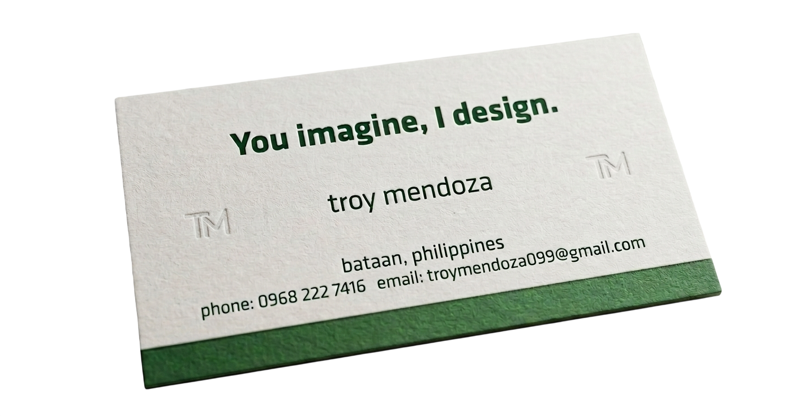

<!-- Header code -->

  

<!-- Introductory text code -->

  

<!-- Section 1 - Introduction code -->

  <!-- GIF LEFT -->
  

    
  

  <!-- TEXT RIGHT -->
  

    <h1>How would you describe yourself?</h1>
    

      

        Ever since I was little, I've always had a passion for design, from traditional arts and crafts to graphic arts. 
        From these deep-rooted hobbies, I developed a keen eye on what makes something visually pleasing and iconically simple. 
        Therefore, I specialized on developing the front-end interfaces of web applications and software systems. 
        I also dabble on the UI and UX architecture of software systems to understand what makes applications user-friendly and usable in the long run.
      

    

  

<!-- This is the business card code -->

  

<!-- Footer code -->

  

